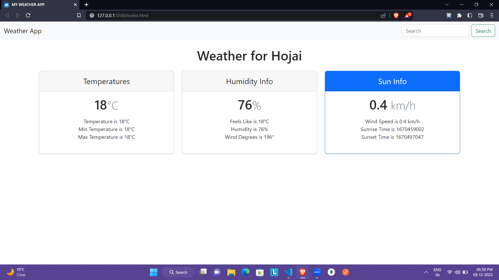

# MY WEATHER APP

## ABOUT

This is a weather app built using HTML, CSS, JavaScript, RapidAPI, and Bootstrap. In this app you can search for your favorite city or place to see the weather of that place.

## Tech-Stack used

- HTML5
- CSS3
- JavaScript
- RapidAPI
- Bootstrap

## Live link of MY WEATHER APP

## Overview of the MY WEATHER APP

